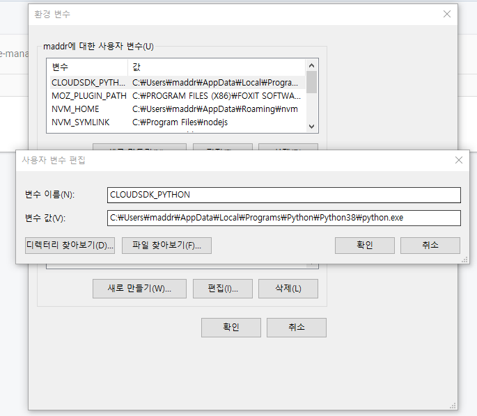
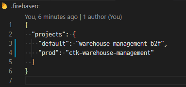

# warehouse-management

## Dependencies

```bash
$ yarn
$ cd functions && yarn
$ cd ..
```

### Compiles and hot-reloads for development

```bash
# compile & hot-reloads
$ yarn serve
# compile & minifies
$ yarn build
```

### Firebase

```bash
$ firebase deploy --only database
$ firebase deploy --only firestore
$ firebase deploy --only funtions
$ firebase deploy --only funtions:createUser,functions:deleteUser ...
```

### Firebase Storage CORS setting

[Gooble Cloud SDK](https://cloud.google.com/sdk/install)

```bash
# First, install Gooble Cloud SDK
$ gcloud init
```

```json
[
  {
    "origin": ["*"],
    "method": ["GET"],
    "maxAgeSeconds": 3600
  }
]
```

```bash
$ gsutil cors set cors.json gs://<your-bucket>
```

#### if gsutil python command not found



### Default firebase account switching

#### add new env var in .firebaserc



```bash
# for prod
$ firebase login serviceaccount@email.com
$ firebase use --add ctk-warehouse-management
$ firebase use ctk-warehouse-management

# for dev
$ firebase login serviceaccount@email.com
$ firebase use --add warehouse-management-b2f
$ firebase use warehouse-management-b2f
```

### Setting

```bash
# for prod
$ firebase functions:config:set admin.prod.email=serviceaccount@email.com admin.prod.db_url=https://ctk-warehouse-management.firebaseio.com

# in functions/index.js
level: email === functions.config().admin.prod.email ? 0 : 5

# for dev
$ firebase functions:config:set admin.dev.email=serviceaccount@email.com admin.dev.db_url=https://warehouse-management-b2f.firebaseio.com

# in functions/index.js
level: email === functions.config().admin.dev.email ? 0 : 5


$ firebase functions:config:get
$ firebase deploy --only functions
```

### Customize configuration

#### check configuration files for firebase

```bash
key.prod.json
key.dev.json
firebase.js
functions/index.js
firebaseConfig.prod.js
firebaseConfig.dev.js
.firebaserc
firebase logout
firebase login
firebase use ctk-warehouse-management
firebase use warehouse-management-b2f
```

#### other configuration

### Firestore indexes

```bash
firebase firestore:indexes
```

See [Configuration Reference](https://cli.vuejs.org/config/).
