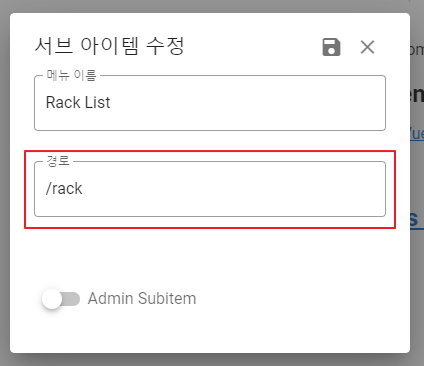
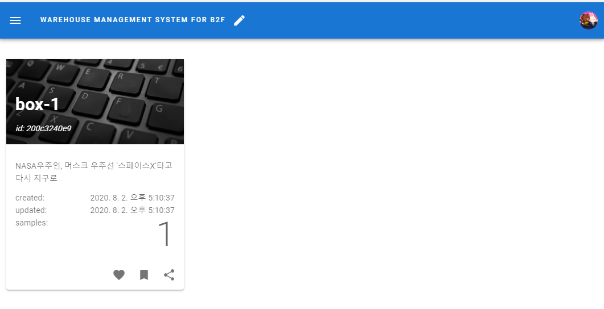
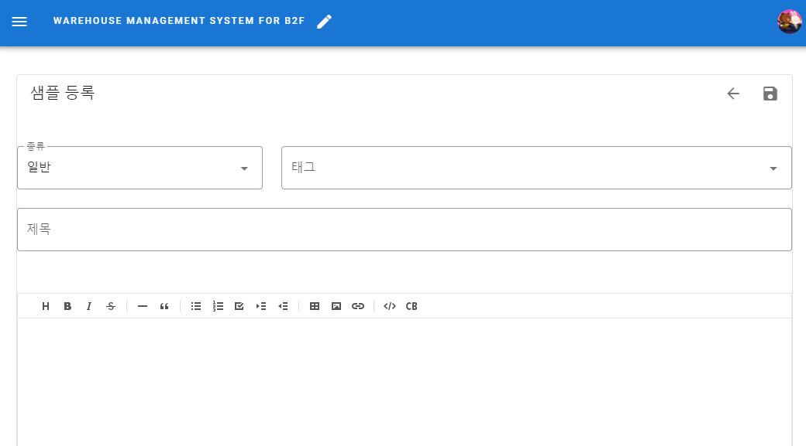

# Warehouse Management 사용법

> 본 서비스는 지하2층 화장품 샘플 창고 관리를 위해 개발되었습니다.
> 기능 추가 및 버그사항은 아래의 게시판을 이용하시기 바랍니다.
> [Feedback](https://warehouse-management-b2f.firebaseapp.com/board/feedback)

---

### 개요

현재 서비스되고 있는 **https://warehouse-management-b2f.firebaseapp.com** 은 테스트용 사이트 이며, 실제 운용 환경에서는 용량 제한 및 성능 이슈로 인하여 사용하기 부적절 합니다. 서버 설정이 필요하므로 별도로 문의하시기 바랍니다. ([shockzinfinity@gmail.com](mailto://shockzinfinity@gmail.com))

---

### 사이트 운영에 관한 일반사항

> 사이트 설정을 위하여 별도의 구글 Firebase 설정이 필요합니다. 특히 내부 기능 중 핵심적인 부분이 Free 요금제인 **Spark** 요금제에서는 동작되지 않으므로, **Blaze** 요금제가 필요합니다.  
> 이를 위해서는 신용카드 등록절차가 필요합니다. 즉, 사이트 설정을 위하여 등록절차가 필요하므로 별도로 문의해주시기 바랍니다.

> MS IE 11을 제외한 대부분의 브라우저에서 (모바일 포함) 테스트 되었으나, 크롬 및 Edge 에서 최적으로 보여집니다.

---

### 관리 범위

- 랙 (Rack)
  : 하위에 박스를 포함하는 개념
- 박스 (Box)
  : 하위에 샘플을 포함하는 개념
- 샘플 (Sample)
  : 샘플 관리 최소 기본 단위

> 2020년 8월 3일 기준으로 Box 및 Sample 등의 이동 기능은 지원하지 않고 있습니다. 추후 개발 예정입니다.  
> 모든 항목(rack, box, sample)은 등록 시점에서 QR code 가 생성됩니다.  
> TODO: QR code specification 첨부

---

### 로그인 및 메뉴

- 로그인
  - **우측 상단**의 로그인 아이콘으로 로그인 하시기 바랍니다.  
    
  - 구글 (Google) 계정만 허용됩니다.  
    
- 권한
  - **전체 사이트 설정 기능은 별도 문의하시기 바랍니다.**
  - 랙 (Rack) 생성/정보수정/제거 는 관리자만 허용됩니다.
  - 박스, 샘플 추가/수정/삭제는 일반 권한에 허용됩니다.
- 사이드 메뉴에 랙 (Rack) 및 박스 (Box) 등록방법  
  
- 가급적 수정 완료 후에는 수정모드를 **해제**하시기 바랍니다.
- Step  
    
    
    
  
- **등록 시 주의사항**
  1. 상위 메뉴의 **아이콘**은 [링크](http://materialdesignicons.com/cdn/2.0.46/)를 참고하시기 바랍니다. (기본 아이콘은 'mdi-crosshairs-question' 입니다.)
  2. 하위 메뉴의 **경로**는 다음과 같은 형식이어야 합니다.
     - rack 전체 리스트: /rack
     - box 전체 리스트: /box
     - 'rack-1'의 직접링크: /rack/rack-1
       
       
  3. _Admin Item_, _Admin Subitem_ 체크 시 관리자만 접근 가능한 메뉴를 만들 수 있습니다.
- 랙 및 박스는 사이드 메뉴에 직접 등록하여 사용할 수 있습니다. (**샘플 직접 링크는 지원하지 않습니다.**)

---

### 랙

- 랙 전체 리스트 화면  
   
- 랙 추가
  > 메뉴에서 직접 등록하는 방법만 지원
  1. 사이드 메뉴 > Rack > 신규 메뉴 추가  
     
  2. 경로: **/rack/{랙 이름}** _e.g. /rack/addRack_  
     
  3. 해당 링크 클릭 혹은 _수정모드_ 해제 후 메뉴 클릭  
     
  4. 랙 세부정보 입력  
     
- 랙 정보 수정
  1. 해당 랙으로 이동
  - 사이드 메뉴 클릭
  2. 정보 아이콘 클릭  
     
  3. 수정 클릭  
     
- **랙 삭제 기능은 관리자에게 문의하시기 바랍니다.**

---

### 박스

- 박스 전체 리스트 화면  
   
- 박스 추가
  1. 포함시키고자 하는 랙에서 추가 클릭  
     
  2. 박스 이름 입력 후 Enter 혹은 저장 버튼 클릭  
     
  3. 세부 정보 입력  
     
- 박스 정보 수정
  1. 해당 박스로 이동
     - 해당 박스가 포함된 랙으로 이동하여 선택  
       
  2. 정보 아이콘 클릭  
     
  3. 수정 클릭  
     
- ** 삭제 기능은 관리자에게 문의하시기 바랍니다.**

---

### 샘플

- 샘플 추가
  1. 포함시키고자 하는 박스에서 추가 클릭  
     
  2. 샘플 추가 (_복사/붙여넣기 사용 가능_)  
     
- 샘플 정보 수정
  1. 포함된 박스 리스트 화면에서 샘플 선택  
     
  2. 수정 클릭  
     
- 재고 수정

  > 샘플 정보 상단 이용

  

- 히스토리 확인

  > 샘플 정보 하단의 history 클릭

    
  

- 댓글, 좋아요

  > 샘플 정보 하단

  

---

### 창고 정보 수정

  

---

### QR code 사용방법

> 스마트폰의 **카메라** 기능 중 QR 코드 인식하는 기능을 가진 카메라에서만 적용됩니다.
> 카메라에서 QR 코드 인식 후 링크를 클릭하면 해당 코드의 정보를 스마트폰에서 확인할 수 있습니다.

---

### 버그 및 요청사항 등록 방법

> **이 서비스는 지속적으로 개발중입니다.**
>
> 추가 기능 요청 사항이나 버그 등을 발견했다면 Feedback 게시판에 등록해주시기 바랍니다.
